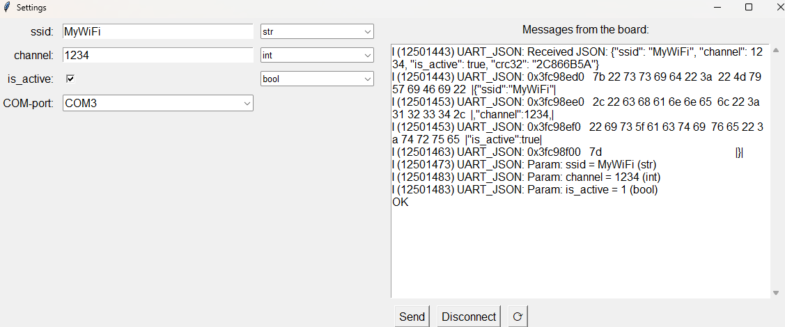

# The application for saving settings on ESP32-S3

## Project Overview

This project is an application that allows you to enter settings and save them on ESP32-S3.

It includes two main components:

### 1. Python app
- Parameters (get from setting file)
- Generates a crc32
- Save parametrs
- Show messages from board

### 2. ESP-idf script
- Saves data in NVS

## How to use Python app

1. Create a settings file with field definitions:
  Each line represents one field.
  The format of each line is:
  ```
  field_name;field_length;default_value;data_type
  ```
  data type can be `int` `str` `bool`

2. Launch `app.exe` from the `python/app` folder
3. Fill in the fields  
4. Select the COM port of your device (to refresh the list, use the **⟳** button)  
5. Press the **Send** button (all settings will be saved in `settings.json`)
6. If you see something like this in the "Messages from board" field, it means the board received all settings correctly:

    ```bash
    Param example=example(str)
    ```
5. To update the firmware on the board, use the **Disconnect** button before updating.

### Example usage

Below is an example screenshot showing the application with filled fields and a successful response from the board:



*Example of filled fields and successful response from the board.*

## How to use C script

You can use C script in your projects:

1. Download and install [ESP-IDF extension for VS Code](https://marketplace.visualstudio.com/items?itemName=espressif.esp-idf-extension)
2. Copy `uart.c` and `uart.h` files into your project folder
3. Add the following line to your `CMakeLists.txt` in the project folder to include `uart.c`:

      ```cmake
      idf_component_register(SRCS "uart.c" INCLUDE_DIRS ".")
      ```

4. To save settings via UART, call:

      ```c
      uart_json_init();
      ```

5. After that, the settings will be saved into NVS

6. **Make sure the ESP-IDF Monitor is closed** before using the Python script. The COM port must be free.

You can also use the provided firmware to save values in NVS without modifying your projects:

1. Open the `firmware` folder and launch **FlashTool.exe**.  
2. Wait until the flashing process is complete.  
3. Send the settings using the Python app.  
4. Now you can flash your own project — all settings will remain stored in NVS.  

Note: This tool uses the `app-setings` namespace. Make sure to use the same namespace in your project.